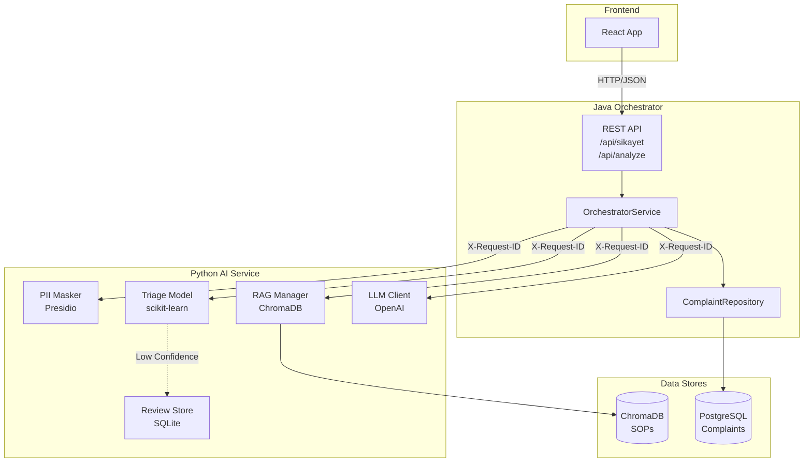
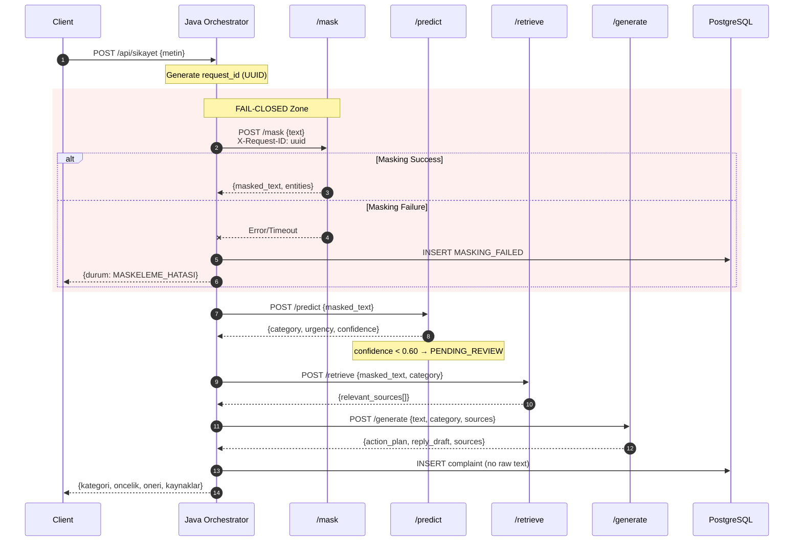
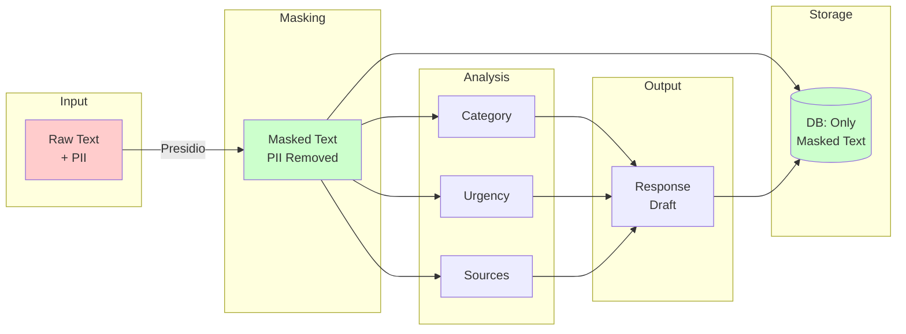

# ComplaintOps Copilot - Mimari Dokümantasyonu

## Sistem Genel Görünümü



---

## İstek Akışı (Sequence Diagram)



---

## Bileşen Detayları

### Java Orchestrator (Spring Boot)

| Dosya | Sorumluluk |
|-------|------------|
| `ComplaintController.java` | REST endpoints, Türkçe mapping |
| `OrchestratorService.java` | İş akışı, fail-closed logic, request ID |
| `Complaint.java` | JPA Entity (no originalText) |
| `DTOs.java` | API kontratları, SourceItem |

### Python AI Service (FastAPI)

| Dosya | Sorumluluk |
|-------|------------|
| `pii_masker.py` | TCKN, IBAN, Email, Telefon maskeleme |
| `triage_model.py` | Kategori + urgency prediction |
| `rag_manager.py` | ChromaDB embedding search |
| `llm_client.py` | OpenAI API, prompt injection guard |
| `review_store.py` | Human review audit trail |

---

## Veri Akışı



---

## Güvenlik Katmanları

| Katman | Koruma | Dosya |
|--------|--------|-------|
| **L1: Input** | PII Maskeleme (Presidio) | `pii_masker.py` |
| **L2: Pipeline** | Fail-Closed (exception → stop) | `OrchestratorService.java` |
| **L3: LLM** | Prompt injection sanitization | `llm_client.py` |
| **L4: Output** | PII leak detection | `llm_client.py:_detect_pii` |
| **L5: Storage** | No raw text field | `Complaint.java` |
| **L6: Logs** | Only masked_text_length | `logging_config.py` |

---

## Konfigürasyon

### Java (application.properties)
```properties
ai-service.url=http://localhost:8000
spring.datasource.url=jdbc:postgresql://localhost:5432/complaintops
```

### Python (environment)
```bash
OPENAI_API_KEY=sk-...
LOG_LEVEL=INFO
RAG_TOP_K=4
ALLOW_RAW_PII_RESPONSE=false
```
